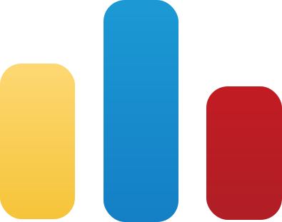

<h2> <em>Hey there</em> <em>   good to see you...</em></h2>
<h1 align='center'>✨ I am Siddharth ✨</h1> 

## :star2: Things you should know about me :
- I am **20 years** old :boy:, and my current residence is in :round_pushpin: _Bally, West Bengal, India_. 🇮🇳
- Currently I am pursuing **B.Tech** in **Information Technology**. :computer:
- I am a pre-final year student at [Jalpaiguri Government Engineering College](https://en.wikipedia.org/wiki/Jalpaiguri_Government_Engineering_College). :school:
- I have keen interest in **DSA**, **Competitive Programming**, and **Web Development**. :globe_with_meridians:
- I am also learning about :chains: **Blockchain** and :art: **UI/UX** designing.
- And I am looking for an internship. :man_technologist:

<h2> :mailbox: Connect with me  </h2>

- <h3> :iphone: Social Media : </h3>
 

|   |  |   |   |
|---|---|---|---|

- <h3> :desktop_computer: Coding Platforms :</h3>
 

|  |  |  |    |  |
|---|---|---|---|---|

<!-- 

 -->

<h2> :tophat: My Skills  </h2>

- <h3> :books: Languages : </h3> 
 

  
|  |  |  |  |  |  |  |  |
|---|---|---|---|---|---|---|---|

- <h3> :necktie: Frameworks :</h3>
 

  
  |  |  |  |  |  |  |  |
  |---|---|---|---|---|---|---|

- <h3> :hammer_and_wrench: Other tools : </h3>
 

  
|  |  |  |  |  |  |  |  |  |  |  |  |  |  |  | 
|---|---|---|---|---|---|---|---|---|---|---|---|---|---|---|---|

###
